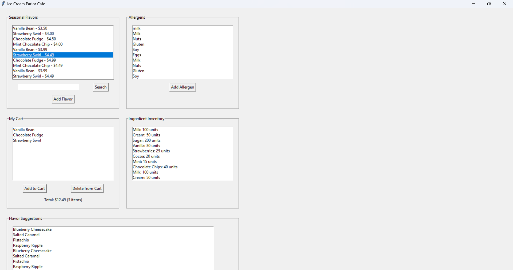

# Ice Cream Parlor Application

Welcome to the Ice Cream Parlor Application! This Python application simulates a fictional ice cream parlor cafe. It allows users to manage seasonal flavor offerings, ingredient inventory, customer flavor suggestions, and allergy concerns using SQLite.



## Features

- **Seasonal Flavors**: Browse and filter through seasonal flavor offerings.
- **Ingredient Inventory**: View available ingredients and their quantities.
- **Customer Suggestions**: See suggestions from customers for new flavors.
- **Allergy Concerns**: Manage allergens and add new ones if they don't exist.
- **Cart Management**: Maintain a cart of favorite products.

## Getting Started

### Prerequisites

- Python 3.0
- `tkinter` library (usually included with Python installation)
- SQLite

### Installation

1. Open the project in PyCharm:

    - Launch PyCharm.
    - Select `Open` from the welcome screen or `File > Open` from the menu.
    - Navigate to the cloned `ice-cream-parlor` directory and select it.

### Running the Application

1. Ensure you are in the project directory with the virtual environment activated.

2. Run the main Python script:

    ```bash
    python ice_cream_parlor.py
    ```

3. The application window should appear, allowing you to interact with the features.

## Testing

To validate the application, follow these steps:

1. **Seasonal Flavors**: Search for a flavor and ensure the list updates accordingly.
2. **Ingredient Inventory**: Check the available ingredients and their quantities.
3. **Customer Suggestions**: Verify that the flavor suggestions list loads correctly.
4. **Allergy Concerns**: Add a new allergen and confirm it appears in the list.
5. **Cart Management**: Add a flavor to the cart and ensure it reflects in the cart section. Delete the flavor from the cart and verify it updates correctly.

## SQL Query Implementation

The application uses SQLite to manage the database. SQL queries are executed to perform CRUD operations on the database tables.

## Documentation

The code is thoroughly documented with comments to explain the functionality of each section and method.
